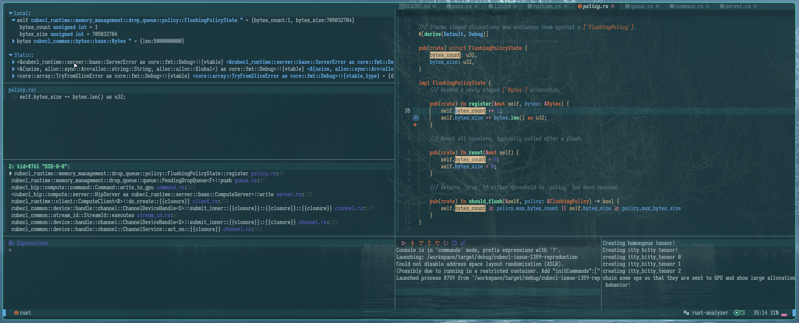

# cubecl-issue-1359-reproduction
Minimal reproduction harness and analysis for the bug I fixed in CubeCL.
Here's a link to the merged PR: [CubeCL PR #1456](https://github.com/tracel-ai/cubecl/pull/1456).
[CubeCL Issue #1359-Hitting addition with overflow in FlushingPolicyState](https://github.com/tracel-ai/cubecl/issues/1359).

## Summary
In `cubecl-hip` version 0.10.0, multiple tensor allocations that are 
**less than 4.29 GiB individually** but **more than 4.29GiB total** can cause 
this error, originally pointed out by `jeandudey`  in 
[CubeCL issue #1359](https://github.com/tracel-ai/cubecl/issues/1359):
```
thread 'DSD-0-0' (13245) panicked at /home/j/.cargo/registry/src/index.crates.io-1949cf8c6b5b557f/cubecl-runtime-0.10.0/src/memory_management/drop_queue/policy.rs:36:9:
attempt to add with overflow
```
I found out the specific conditions under which this bug could be reproduced by learning how CubeCL allocates memory.

### Environment
- `cubecl-runtime v0.10.0`
- `cubecl-hip v0.10.0`, also applies to `cubecl-cuda v0.10.0`, but using AMD ROCm here.

## Failure Mechanism

The panic originates inside the host-side resource tracking layer of the `cubecl-runtime` crate, specifically within the `register` function of `FlushingPolicyState`:
```rust
/// Tracks staged allocations and evaluates them against a [`FlushingPolicy`].
#[derive(Default, Debug)]
pub(crate) struct FlushingPolicyState {
    bytes_count: u32,
    bytes_size: u32,
}

impl FlushingPolicyState {
    /// Record a newly staged [`Bytes`] allocation.
    pub(crate) fn register(&mut self, bytes: &Bytes) {
        self.bytes_count += 1;
        self.bytes_size += bytes.len() as u32;
    }
}
```
Since the panic happened on both WSL on ROCm as well as CUDA per the issue, it 
was clear that the issue was vendor-agnostic. To reproduce the bug, I used 
`lldb` to inspect state at the time of the crash:

### Code to Reproduce
Since the bug triggers when multiple tensors, individually less than 4.29GiB, 
but collectively more than 4.29GiB were written to the GPU between kernel 
launches, I wrote a minimal reproduction function that does just that:
```rust
fn trigger_overflow_burn_multiple_tensors<B: Backend>(device: &B::Device) {
    let mut tensors = Vec::new();
    let shape = [625_000_000]; // 625,000,000 f32s * 4 bytes = 2.5GiB,
    println!("Big data dump into allocation queue");
    for i in 0..3 {
        println!("creating tensor {i}");
        let data = TensorData::ones::<f32, _>(shape);
        let tensor = Tensor::<B, 1>::from_data(data, device);
        tensors.push(tensor);
    }
    println!("chain some ops, force load to GPU and make it crash");
    let mut computation = tensors[0].clone();

    println!("The overflow will happen about here.");
    for tensor in tensors.iter().skip(1) {
        computation = computation * tensor.clone();
    }
    let raw_data = computation.into_data();
    println!("raw_data: {:?}", raw_data);
}
```
In this function, three tensors of 2.5GiB are allocated. CubeCL uses lazy 
evaluation, so it does not send tensors to the GPU until they are used in the 
multiplication, so the panic does not happen until the multiplication occurs. 
Since CubeCL does not check to flush on each tensor allocation, and only checks
in GPU kernel launches, the loop causes `FlushingPolicyState.bytes_size` to 
overflow with >5GiB of allocations before the next kernel launch can flush it.

## Root Cause Analysis
If you're reading this and you're still interested, this is the part where I'll
talk a little bit more about the thought process that I used to find the root 
cause of the bug. I knew that a simple type widening of a value may have been a
band-aid fix because developers often build little sanity checks into their 
code. NASA, for example, uses lots of assert statements that act as canaries,
so that assumptions that were written during engineering are made explicit.
Thus, I started thinking that the fact that the `u32` type
in `FlushingPolicyState.bytes_size` was intentional. 

I wondered what it could have been--a producer-consumer imbalance? That's what
I thought at first. I quickly rejected that hypothesis as I could not find
sufficient evidence. I was wondering if it were a race condition--the OP said
that the problem occurred with more threads. So I bumped up the thread count 
and, rather than this particular bug, got an OOM error and my compositor 
crashed, and I couldn't find the same bug message in the logs. 
In my mind, the race condition case would mean that multiple threads 
were able to race to the FlushingPolicyState counter faster than it could
get a chance to flush itself. To determine that, I knew I'd have to understand
the architecture.

Therefore, I started asking architectural questions: 
What is the `FlushingPolicyState` anyway? What is its purpose?
What does it do? I had never worked on anything this complex in Rust before, 
so I started off flailing 
with `println!` macros and trying to just read the code for three 
weeks. I tried everything I could think of; but CubeCL is an async runtime
with many moving parts: procmacros, channels, and lots of threads going 
simultaneously. Beautiful software engineering. Nevertheless,
I realized that `println!` and reading the code just weren't going to cut the 
mustard. I realized it would behoove me to see if the Rust 
ecosystem had a good debugger. Turns out it did; so I set up `lldb` in my
AstroNvim installation with the defaults from the 
`astronvim-community` repository. 

Once I set up `lldb`, figuring out how the system worked was much easier. For a 
while there, it felt like Sisyphus pushing on that boulder in Tartarus--I had 
chosen a bit of a challenging task to start with in the low-level space, but
I just knew there had to be some mechanistic reason for the `u32` overflow. 
With `lldb`, I could only see that `FlushingPolicyState.register()` get called
in one situation: when kernels are launched.

To figure that out though, I had to get a decent idea of how CubeCL sends work
to the GPU. So I ran the OP's code and dropped a breakpoint on 
`FlushingPolicyState.register()`. Then I stepped out of functions until
I could see the `FlushingPolicyState.register()`'s caller. I only saw one 
function that ever actually called it, and it was in `cubecl-hip`:
`write_to_gpu()`, which was called by the kernel launching function of the 
`ComputeServer` which is `kernel`. I then noticed that in that 
very same thread and execution path, that `PendingDropQueue.should_flush()`
was called. My race condition disproved for the time being, I was stumped.
If the only place was `kernel` and in the same thread `should_flush`, 
why was an overflow happening? I decided to try overflowing it by allocating 
a single 5GiB tensor.


### The first of many false leads: allocating a tensor larger than 4.29GiB doesn't reproduce the bug 
I attempted to reproduce the bug by allocating a 5 GiB tensor:
```rust
fn allocate_humongous_tensor<B: Backend>(device: &B::Device) {
    let shape = [1_250_000_000]; // 1,250,000,000 f32s * 4 bytes = 5.0GiB
    println!("Creating humongous tensor!");
    let humongous_data = TensorData::ones::<f32, _>(shape);
    let humongous_tensor = Tensor::<B, 1>::from_data(humongous_data, device);
    println!("Creating itty bitty tensor!");
    let itty_bitty_shape = [1]; //
    let mut itty_bitty_tensors = Vec::new();
    for i in 0..3 {
        println!("creating itty_bitty_tensor {i}");
        let itty_bitty_data = TensorData::ones::<f32, _>([1]);
        let itty_bitty_tensor = Tensor::<B, 1>::from_data(itty_bitty_data, device);
        itty_bitty_tensors.push(itty_bitty_tensor.clone());
    }

    println!("chain some ops so that they are sent to GPU and show large allocation behavior!");
    let mut computation = itty_bitty_tensors[0].clone();
    for itty_bitty_tensor in itty_bitty_tensors.iter().skip(1) {
        computation = computation * humongous_tensor.clone();
    }
    let raw_data = computation.into_data();
    println!("raw_data: {:?}", raw_data);
}
```
I thought, "Surely I'll trigger the bug now! I've allocated more than 4.2GiB into the `PendingDropQueue`!" No dice:

Look at that! The debugger's stopped on line 37, the addition to `self.bytes_size` 
is completed. Look at the top left: `bytes` reports a length of 5 billion, yet
`self.bytes_size` is only 705032704. 
Why? Because using the `as` keyword when casting a larger numeric type
to a narrower integer type executes a silent bitwise truncation, 
chopping off any bits in the $2^{32}$ place or higher.
In the moment, this absolutely mystified me because I didn't notice the 
truncation happening.

### Another detour: why it's not a race condition
Then I thought, _Well maybe it's a race condition.
Maybe multiple worker threads queue up asynchronous work and/or memory
allocations to the GPU faster than `FlushingPolicyState`
can check itself with `should_flush`._ To verify this hypothesis, 
I started using my trusty debugger to go through the architecture of how CubeCL 
loads up tensors and issues commands to the GPU.

I learned a lot about how async runtimes work, and how CubeCL handles things.
It was quite the journey through a procmacro, an async message-passing pipeline, 
custom `Drop` implementations, and so on. Massive respect to maintainers, 
I learned a ton from just using `lldb` to inspect how it worked.
That pipeline was clearly NOT easy to make and it absolutely performs.

At any rate, to figure out how work items were scheduled, I dropped a breakpoint on 
`FlushingPolicyState.register()` and stepped the debugger out of the stack frames 
to evaluate caller lineage. Very generally, the workload pipeline evaluates
like this:
1. A matrix or tensor operation is called from the high-level interface in `burn`,
such as a `Conv2d` layer call.
2. The front end, `burn` puts this operation into a queue via message passing.
3. The message arrives in `cubecl-hip`'s boundaries. The most relevant  
components of `cubecl` for this report, the `ComputeClient` and `ComputeServer`,
are generic over backend type (e.g. `rocm`, `cuda`, `vulkan`, etc.), 
and the exact crate changes depending on what backend is used.
The `ComputeClient` receives the op from the front end.
4. The `ComputeClient` puts it in a queue to pass to the `ComputeServer`.
5. The custom channel in `cubecl-common` can have more than the two 
following threads, but in my case, consistently, two threads were generated and
used: `DSU-0-0` and `DSD-0-0`.
6. DSU is short for Device Service stage Upstream, and is responsible for producing 
work ahead of time, such as autodiff graph construction and kernel fusion.
7. DSD is short for Device Service stage Downstream, and is responsible for managing
GPU memory and launching kernels.
8. `DSD-0-0` received the op, ran `FlushingPolicyState.register()` via 
`PendingDropQueue.register()`, launched the kernel, checked `should_flush()`, 
and flushed if needed.

I stared at `DSD-0-0`'s codepath, stumped. I stared at what I thought was the 
one logical path that called `FlushingPolicyState.register()`.

My hypothesis disproven, I recorded what evidence I found.
I knew it wasn't a race condition because the only thread that launched
kernels and registered memory in the `FlushingPolicyState` also immediately
checked `should_flush` and if necessary, flushed itself. I began to wonder
if the problem were a quirk of WSL that was also common to using CUDA
on Linux when allocating large numbers of tensors.

### Another false alarm: WSL behavior
Per OP, this bug occurred on WSL. Since on my machine I was getting OOM errors 
on my card, the same card as the OP, and crashing, 
and the OP was experiencing VRAM usage at around 12GiB,
I started to wonder if the Windows VRAM allocator was pushing tensor allocations
to page memory and, therefore, slowing down the pipeline to kernel launch, 
resulting in a `FlushingPolicyState` overflow. After several hours of research,
I determined that the documentation was not clear enough to give a 
definitive answer. Additionally, another poster running CUDA 
on Arch Linux was reporting the same bug.
Since evidence was insufficient for now, I decided to go back to the debugger.

### _Wait, that's funny..._
It all starts with, _Wait, that's funny..._ doesn't it? This root cause sure did.
I was looking all over the code base, setting conditional breakpoints in `lldb`
for anything that might cause the runtime to break. Absolutely nothing. I was 
mystified. At some point I just gave up and made a conditional breakpoint such
that when anything over 2MiB was in the `FlushingPolicyState.bytes_size` 
it would stop.
I also had another breakpoint on the `FlushingPolicyState.should_flush()` method.
I was in a bit of a zombie mode at that point, hoping, wishing, for something to
happen. I was just on the precipice of wondering whether this was worth my time,
or if I was ever going to find it, but I kept at it. After pushing the continue
button for `nvim-dap` many, many times, I saw something. 
I thought, "Wait, that's funny..." and realized that 
`FlushingPolicyState.register()` was being called multiple times between 
`FlushingPolicyState.should_flush()` calls.
I got really excited. The only thing I had to figure out next was how.
I was out of time for that day so I logged off. 

The next day, for the first
hour or so, I could not for the life of me get it to happen again.
With dismay I desperately kept hitting F5. Then--finally--it happened again.
And I still had some time.

### The actual root cause was surprising
So: `FlushingPolicyState.register()` was being called multiple times between 
calls to `FlushingPolicyState.should_flush()`. That was a start to finding the true
cause, I was almost sure of it. So I used my newly-found tool `lldb` with 
`nvim-dap` to figure out what part of the code was doing it. The next time
`FlushingPolicyState.register()` was called, I stepped out until I could see
how exactly it all happened. I finally found it. When allocating  
tensors, `cubecl-runtime` does not check `FlushingPolicyState.should_flush()`.
It only checks `should_flush` when launching kernels. I started to get really
excited. A backtrace of tensor allocation shows the following:
```
2: tid=17166 "DSD-0-0":
 cubecl_runtime::memory_management::drop_queue::policy::FlushingPolicyState::register policy.rs:36
 cubecl_runtime::memory_management::drop_queue::queue::PendingDropQueue<F>::push queue.rs:87
 cubecl_hip::compute::command::Command::write_to_gpu command.rs:315
 <cubecl_hip::compute::server::HipServer as cubecl_runtime::server::base::ComputeServer>::write server.rs:120
 cubecl_runtime::client::ComputeClient<R>::do_create::{{closure}} client.rs:276
 cubecl_common::device::handle::channel::ChannelDeviceHandle<S>::submit_inner::{{closure}}::{{closure}}::{{closure}} channel.rs:129
 cubecl_common::stream_id::StreamId::executes stream_id.rs:43
 cubecl_common::device::handle::channel::ChannelDeviceHandle<S>::submit_inner::{{closure}}::{{closure}} channel.rs:129
 cubecl_common::device::handle::channel::ChannelService::act_on::{{closure}} channel.rs:362
 std::thread::local::LocalKey<core::cell::RefCell<T>>::with_borrow::{{closure}} local.rs:673
 std::thread::local::LocalKey<T>::try_with local.rs:462
 std::thread::local::LocalKey<T>::with local.rs:426
 std::thread::local::LocalKey<core::cell::RefCell<T>>::with_borrow local.rs:673
 cubecl_common::device::handle::channel::ChannelService::act_on channel.rs:357
 cubecl_common::device::handle::channel::ChannelDeviceHandle<S>::submit_inner::{{closure}} channel.rs:124
 <core::panic::unwind_safe::AssertUnwindSafe<F> as core::ops::function::FnOnce<()>>::call_once unwind_safe.rs:275
 std::panicking::catch_unwind::do_call panicking.rs:581
 std::panicking::catch_unwind panicking.rs:544
 std::panic::catch_unwind panic.rs:359
 cubecl_common::device::handle::channel::task::Task::init::{{closure}} channel.rs:480
 core::ops::function::FnOnce::call_once function.rs:250
 cubecl_common::device::handle::channel::task::Task::run channel.rs:499
 cubecl_common::device::handle::channel::custom_channel::Server::execute_tasks channel.rs:818
 cubecl_common::device::handle::channel::custom_channel::Server::start channel.rs:792
 cubecl_common::device::handle::channel::custom_channel::DeviceClient::new::{{closure}} channel.rs:648

1: tid=17163 "cubecl-issue-13":
 cubecl_common::device::handle::channel::custom_channel::DeviceClient::new channel.rs:639
 cubecl_common::device::handle::channel::DeviceRunner::start channel.rs:371
 cubecl_common::device::handle::channel::ChannelDeviceState::init::{{closure}} channel.rs:282
 hashbrown::map::Entry<K,V,S,A>::or_insert_with map.rs:3636
 cubecl_common::device::handle::channel::ChannelDeviceState::init channel.rs:282
 <cubecl_common::device::handle::channel::ChannelDeviceHandle<S> as cubecl_common::device::handle::base::DeviceHandleSpec<S>>::new channel.rs:57
 cubecl_common::device::handle::DeviceHandle<S>::new mod.rs:53
 burn_fusion::client::GlobalFusionClient<R>::load client.rs:60
 burn_fusion::backend::get_client backend.rs:16
 burn_fusion::ops::tensor::<impl burn_backend::backend::ops::tensor::FloatTensorOps<burn_fusion::backend::Fusion<B>> for burn_fusion::backend::Fusion<B>>::float_from_data tensor.rs:25
 burn_autodiff::ops::tensor::<impl burn_backend::backend::ops::tensor::FloatTensorOps<burn_autodiff::backend::Autodiff<B,C>> for burn_autodiff::backend::Autodiff<B,C>>::float_from_data tensor.rs:58
 burn_backend::tensor::ops::float::<impl burn_backend::tensor::ops::base::BasicOps<B> for burn_backend::tensor::kind::Float>::from_data float.rs:226
 burn_tensor::tensor::api::base::Tensor<B,_,K>::from_data base.rs:1955
 cubecl_issue_1359_reproduction::trigger_overflow_burn_multiple_tensors main.rs:12
 cubecl_issue_1359_reproduction::main main.rs:52
 core::ops::function::FnOnce::call_once function.rs:250
 std::sys::backtrace::__rust_begin_short_backtrace backtrace.rs:166
 std::rt::lang_start::{{closure}} rt.rs:206
 std::rt::lang_start rt.rs:205

3: tid=17167 "DSD-0-0":
 __GI___ioctl @ioctl:18

4: tid=17169 "DSD-0-0":
 syscall @syscall:12
 cubecl_runtime::stream::event::GcThread<B>::new::{{closure}} event.rs:130

5: tid=17170 "DSU-0-0":
 __GI___clock_nanosleep @clock_nanosleep@GLIBC_2.2.5:63
 cubecl_common::device::handle::channel::custom_channel::Server::start channel.rs:809
 cubecl_common::device::handle::channel::custom_channel::DeviceClient::new::{{closure}} channel.rs:648

6: tid=17171 "DSD-0-0":
 __GI___ioctl @ioctl:18

```
This stacktrace is a snapshot of when `FlushingPolicyState.register()` is 
called. To find out how the bug happened, I reasoned that somewhere in the 
stack, there had to be a function that was calling 
`FlushingPolicyState.register()` without checking `should_flush()`. 
When I stepped out with the debugger, I traced that stack upward, and I finally
found it here:
```
 cubecl_hip::compute::command::Command::write_to_gpu command.rs:315
```
Look very closely at this function from the source code:
```Rust
    /// Writes data from the host to GPU memory as specified by the copy descriptor.
    ///
    /// # Parameters
    ///
    /// * `descriptor` - Describes the destination GPU memory, its shape, strides, and element size.
    /// * `data` - The host data to write to the GPU.
    ///
    /// # Returns
    ///
    /// * `Ok(())` - If the write operation succeeds.
    /// * `Err(IoError)` - If the strides are invalid or the resource cannot be accessed.
    pub fn write_to_gpu(&mut self, descriptor: CopyDescriptor, data: Bytes) -> Result<(), IoError> {
        let CopyDescriptor {
            handle: binding,
            shape,
            strides,
            elem_size,
        } = descriptor;
        if !has_pitched_row_major_strides(&shape, &strides) {
            return Err(IoError::UnsupportedStrides {
                backtrace: BackTrace::capture(),
            });
        }

        let resource = self.resource(binding)?;
        let size = data.len();
        let data = match data.property() {
            AllocationProperty::File => {
                let mut buffer = self.reserve_pinned(size, None).unwrap();
                data.copy_into(&mut buffer);
                buffer
            }
            _ => data,
        };
        let current = self.streams.current();

        // SAFETY: `resource` is a valid GPU allocation, `data` is a valid host buffer,
        // and `current.sys` is an initialized HIP stream. The shape/strides have been
        // validated above to be pitched row-major.
        unsafe {
            write_to_gpu(resource, &shape, &strides, elem_size, &data, current.sys)?;
        };

        current.drop_queue.push(data);

        Ok(())
    }
```
`current.drop_queue.push(data)` doesn't have a corresponding 
`current.drop_queue.should_flush()`! I kept travelling up the stack trace 
to see if `should_flush()` was called elsewhere. Sure enough, it wasn't.
I then dropped a breakpoint in this particular function to increase my 
certainty about what was going on, and sure enough, it did allow
multiple calls to `FlushingPolicyState.register()` without checking 
`should_flush()`.


Having determined the root cause of the bug, I finally was able to write 
the code reproduce the bug that I showed earlier. 
It wrote multiple 2.5GiB tensors to the GPU between kernel launches.
A quick run of the debugger again, there it was, my beautiful error message:
```
thread 'DSD-0-0' (13245) panicked at /home/j/.cargo/registry/src/index.crates.io-1949cf8c6b5b557f/cubecl-runtime-0.10.0/src/memory_management/drop_queue/policy.rs:36:9:
attempt to add with overflow
```


## The fix was quite simple
Now that I understood the root cause of the issue and had a simple way to
reproduce the bug, it was time to patch it. 

I observed that when launching kernels, `cubecl-hip` and `cubecl-cuda` both 
check their drop queues. Here is a backtrace from when kernels are 
launched on `cubecl-hip`:
```
2: tid=17844 "DSD-0-0":
 cubecl_hip::compute::command::Command::kernel command.rs:400
 cubecl_hip::compute::server::HipServer::launch_checked server.rs:401
 <cubecl_hip::compute::server::HipServer as cubecl_runtime::server::base::ComputeServer>::launch server.rs:135
 cubecl_runtime::client::ComputeClient<R>::launch_inner::{{closure}} client.rs:706
 cubecl_common::device::handle::channel::ChannelDeviceHandle<S>::submit_inner::{{closure}}::{{closure}}::{{closure}} channel.rs:129
 cubecl_common::stream_id::StreamId::executes stream_id.rs:43
 cubecl_common::device::handle::channel::ChannelDeviceHandle<S>::submit_inner::{{closure}}::{{closure}} channel.rs:129
 cubecl_common::device::handle::channel::ChannelService::act_on::{{closure}} channel.rs:362
 std::thread::local::LocalKey<core::cell::RefCell<T>>::with_borrow::{{closure}} local.rs:673
 std::thread::local::LocalKey<T>::try_with local.rs:462
 std::thread::local::LocalKey<T>::with local.rs:426
 std::thread::local::LocalKey<core::cell::RefCell<T>>::with_borrow local.rs:673
 cubecl_common::device::handle::channel::ChannelService::act_on channel.rs:357
 cubecl_common::device::handle::channel::ChannelDeviceHandle<S>::submit_inner::{{closure}} channel.rs:124
 <core::panic::unwind_safe::AssertUnwindSafe<F> as core::ops::function::FnOnce<()>>::call_once unwind_safe.rs:275
 std::panicking::catch_unwind::do_call panicking.rs:581
 std::panicking::catch_unwind panicking.rs:544
 std::panic::catch_unwind panic.rs:359
 cubecl_common::device::handle::channel::task::Task::init::{{closure}} channel.rs:480
 core::ops::function::FnOnce::call_once function.rs:250
 cubecl_common::device::handle::channel::task::Task::run channel.rs:499
 cubecl_common::device::handle::channel::custom_channel::Server::execute_tasks channel.rs:818
 cubecl_common::device::handle::channel::custom_channel::Server::start channel.rs:792
 cubecl_common::device::handle::channel::custom_channel::DeviceClient::new::{{closure}} channel.rs:648

1: tid=17842 "cubecl-issue-13":
 syscall @syscall:12
 oneshot::receiver::Receiver<T>::recv receiver.rs:189
 cubecl_common::device::handle::channel::ChannelDeviceHandle<S>::run_scoped channel.rs:171
 <cubecl_common::device::handle::channel::ChannelDeviceHandle<S> as cubecl_common::device::handle::base::DeviceHandleSpec<S>>::submit_blocking channel.rs:80
 cubecl_common::device::handle::DeviceHandle<S>::submit_blocking mod.rs:69
 cubecl_runtime::client::ComputeClient<R>::do_read client.rs:104
 cubecl_runtime::client::ComputeClient<R>::read_tensor_async client.rs:156
 cubecl_runtime::client::ComputeClient<R>::read_one_tensor_async client.rs:181
 burn_cubecl::ops::base::into_data::{{closure}} base.rs:38
 burn_cubecl::ops::tensor::<impl burn_backend::backend::ops::tensor::FloatTensorOps<burn_cubecl::backend::CubeBackend<R,F,I,BT>> for burn_cubecl::backend::CubeBackend<R,F,I,BT>>::float_into_data::{{closure}} tensor.rs:67
 burn_fusion::tensor::FusionTensor<R>::into_data::{{closure}} tensor.rs:140
 burn_fusion::ops::tensor::<impl burn_backend::backend::ops::tensor::FloatTensorOps<burn_fusion::backend::Fusion<B>> for burn_fusion::backend::Fusion<B>>::float_into_data::{{closure}}::{{closure}} tensor.rs:180
 burn_fusion::ops::tensor::<impl burn_backend::backend::ops::tensor::FloatTensorOps<burn_fusion::backend::Fusion<B>> for burn_fusion::backend::Fusion<B>>::float_into_data::{{closure}} tensor.rs:170
 burn_autodiff::ops::tensor::<impl burn_backend::backend::ops::tensor::FloatTensorOps<burn_autodiff::backend::Autodiff<B,C>> for burn_autodiff::backend::Autodiff<B,C>>::float_into_data::{{closure}}::{{closure}} tensor.rs:88
 burn_autodiff::ops::tensor::<impl burn_backend::backend::ops::tensor::FloatTensorOps<burn_autodiff::backend::Autodiff<B,C>> for burn_autodiff::backend::Autodiff<B,C>>::float_into_data::{{closure}} tensor.rs:78
 burn_backend::tensor::ops::float::<impl burn_backend::tensor::ops::base::BasicOps<B> for burn_backend::tensor::kind::Float>::into_data_async::{{closure}} float.rs:216
 burn_tensor::tensor::api::base::Tensor<B,_,K>::into_data_async::{{closure}} base.rs:1933
 futures_lite::future::block_on::{{closure}} future.rs:96
 std::thread::local::LocalKey<T>::try_with local.rs:462
 std::thread::local::LocalKey<T>::with local.rs:426
 futures_lite::future::block_on future.rs:75
 cubecl_common::future::block_on future.rs:39
 cubecl_common::reader::try_read_sync reader.rs:28
 burn_tensor::tensor::api::base::Tensor<B,_,K>::try_into_data base.rs:1913
 burn_tensor::tensor::api::base::Tensor<B,_,K>::into_data base.rs:1899
 cubecl_issue_1359_reproduction::trigger_overflow_burn_multiple_tensors main.rs:22
 cubecl_issue_1359_reproduction::main main.rs:52
 core::ops::function::FnOnce::call_once function.rs:250
 std::sys::backtrace::__rust_begin_short_backtrace backtrace.rs:166
 std::rt::lang_start::{{closure}} rt.rs:206
 std::rt::lang_start rt.rs:205

3: tid=17845 "DSD-0-0":
 __GI___ioctl @ioctl:18

4: tid=17847 "DSD-0-0":
 syscall @syscall:12
 cubecl_runtime::stream::event::GcThread<B>::new::{{closure}} event.rs:130

5: tid=17848 "DSU-0-0":
 __GI___clock_nanosleep @clock_nanosleep@GLIBC_2.2.5:63
 cubecl_common::device::handle::channel::custom_channel::Server::start channel.rs:809
 cubecl_common::device::handle::channel::custom_channel::DeviceClient::new::{{closure}} channel.rs:648

6: tid=17849 "DSD-0-0":
 __GI___ioctl @ioctl:18

```
This function
```
 cubecl_hip::compute::command::Command::kernel command.rs:400
```
is the function that sends kernels off to the GPU. Here is its source:
```Rust
    pub fn kernel(
        &mut self,
        kernel_id: KernelId,
        kernel: Box<dyn CubeTask<HipCompiler>>,
        mode: ExecutionMode,
        dispatch_count: (u32, u32, u32),
        resources: &[GpuResource],
        logger: Arc<ServerLogger>,
    ) -> Result<(), LaunchError> {
        if !self.ctx.module_names.contains_key(&kernel_id) {
            self.ctx.compile_kernel(&kernel_id, kernel, mode, logger)?;
        }

        let stream = self.streams.current();

        let result = self
            .ctx
            .execute_task(stream, kernel_id, dispatch_count, resources);

        if stream.drop_queue.should_flush() {
            stream.drop_queue.flush(|| Fence::new(stream.sys));
        }

        if let Err(err) = result {
            match self.ctx.timestamps.is_empty() {
                true => Err(err)?,
                false => self.ctx.timestamps.error(ProfileError::Launch(err)),
            }
        };

        Ok(())
    }
```
Aha! It has
```Rust
if stream.drop_queue.should_flush() {
    stream.drop_queue.flush(|| Fence::new(stream.sys));
}
```
which checks if the `PendingDropQueue` (and by extension the 
`FlushingPolicyState`) should be flushed, and flushes it if needed. Therefore,
the fix for this issue was very simple. To patch it locally, I simply added
almost the exact same code to `write_to_gpu`:
```Rust
▏   pub fn write_to_gpu(&mut self, descriptor: CopyDescriptor, data: Bytes) -> Result<(), IoError> {
   ▏   ▏   let CopyDescriptor {
   ▏   ▏   ▏   handle: binding,
   ▏   ▏   ▏   shape,
   ▏   ▏   ▏   strides,
   ▏   ▏   ▏   elem_size,
   ▏   ▏   } = descriptor;
   ▏   ▏   if !has_pitched_row_major_strides(&shape, &strides) {
   ▏   ▏   ▏   return Err(IoError::UnsupportedStrides {
   ▏   ▏   ▏   ▏   backtrace: BackTrace::capture(),
   ▏   ▏   ▏   });
   ▏   ▏   }
   ▏   ▏
   ▏   ▏   let resource = self.resource(binding)?;
   ▏   ▏   let size = data.len();
   ▏   ▏   let data = match data.property() {
   ▏   ▏   ▏   AllocationProperty::File => {
   ▏   ▏   ▏   ▏   let mut buffer = self.reserve_pinned(size, None).unwrap();
   ▏   ▏   ▏   ▏   data.copy_into(&mut buffer);
   ▏   ▏   ▏   ▏   buffer
   ▏   ▏   ▏   }
   ▏   ▏   ▏   _ => data,
   ▏   ▏   };
   ▏   ▏   let current = self.streams.current();
   ▏   ▏
   ▏   ▏   // SAFETY: `resource` is a valid GPU allocation, `data` is a valid host buffer,
   ▏   ▏   // and `current.sys` is an initialized HIP stream. The shape/strides have been
   ▏   ▏   // validated above to be pitched row-major.
   ▏   ▏   unsafe {
   ▏   ▏   ▏   write_to_gpu(resource, &shape, &strides, elem_size, &data, current.sys)?;
   ▏   ▏   };
   ▏   ▏
   ▏   ▏   current.drop_queue.push(data);
   ▏   ▏
           // PATCH START
   ▏   ▏   if current.drop_queue.should_flush() {
   ▏   ▏   ▏   current.drop_queue.flush(|| Fence::new(current.sys));
   ▏   ▏   }
           // PATCH END
   ▏   ▏
   ▏   ▏   Ok(())
   ▏   }
```

I ran it a couple times, and saw that the bug was fixed! No more overflows!
Excited, I forked `cubecl` main, made my branch, and navigated to 
`write_to_gpu`. I then saw the following:
```Rust
    pub fn write_to_gpu(&mut self, descriptor: CopyDescriptor, data: Bytes) -> Result<(), IoError> {
        let CopyDescriptor {
            handle: binding,
            shape,
            strides,
            elem_size,
        } = descriptor;
        if !has_pitched_row_major_strides(&shape, &strides) {
            return Err(IoError::UnsupportedStrides {
                backtrace: BackTrace::capture(),
            });
        }

        let resource = self.resource(binding)?;
        let size = data.len();

        // An empty tensor (a zero dim in its shape) has nothing to copy. Bail
        // before staging: the zero-size staging buffer has no real backing (a
        // dangling pointer), and the 2D copy below would still transfer
        // `width_bytes` from it when only the leading dims are zero.
        if size == 0 {
            return Ok(());
        }

        let property = data.property();

        // Transfers up to this size go through a pinned staging buffer (faster DMA).
        const STAGE_MAX: usize = 100 * MB;
        // Above this size we flush the drop queue so the source buffer is released promptly.
        const FLUSH_MIN: usize = 10 * MB;

        // Stage file-backed data, and small host data that isn't already pinned. Re-staging
        // already-pinned memory would be a redundant pinned-to-pinned copy.
        let should_stage = matches!(property, AllocationProperty::File)
            || (size < STAGE_MAX && !matches!(property, AllocationProperty::Pinned));
        let should_flush = size > FLUSH_MIN || matches!(property, AllocationProperty::File);

        let data = match should_stage {
            true => {
                let mut buffer = self.reserve_pinned(size, None).unwrap();
                data.copy_into(&mut buffer);
                buffer
            }
            false => data,
        };

        let current = self.streams.current();

        // SAFETY: `resource` is a valid GPU allocation, `data` is a valid host buffer,
        // and `current.sys` is an initialized HIP stream. The shape/strides have been
        // validated above to be pitched row-major.
        unsafe {
            write_to_gpu(resource, &shape, &strides, elem_size, &data, current.sys)?;
        };

        current.drop_queue.push(data);

        // Defer fenced flushes while capturing — a host sync aborts the capture.
        if should_flush && !current.capturing.is_recording() {
            current.drop_queue.flush(|| Fence::new(current.sys));
        }

        Ok(())
    }
```

While the code from main was different, the core issue was still there. 
I noticed that maintainers had added a check to see if that stream was
recording the current graph. If a fenced flush occurs while capturing,
that would require a host sync, and that would abort whatever capture
activity was occurring. Thus, for both 
`cubecl-cuda` and `cubecl-hip`, I added a `should_flush()` check, also 
respecting the new graph recording:

```Rust
        if (should_flush || current.drop_queue.should_flush()) && !current.capturing.is_recording() {
            current.drop_queue.flush(|| Fence::new(current.sys));
        }
```
I wrote a PR and it was merged in [CubeCL PR #1456](https://github.com/tracel-ai/cubecl/pull/1456).

